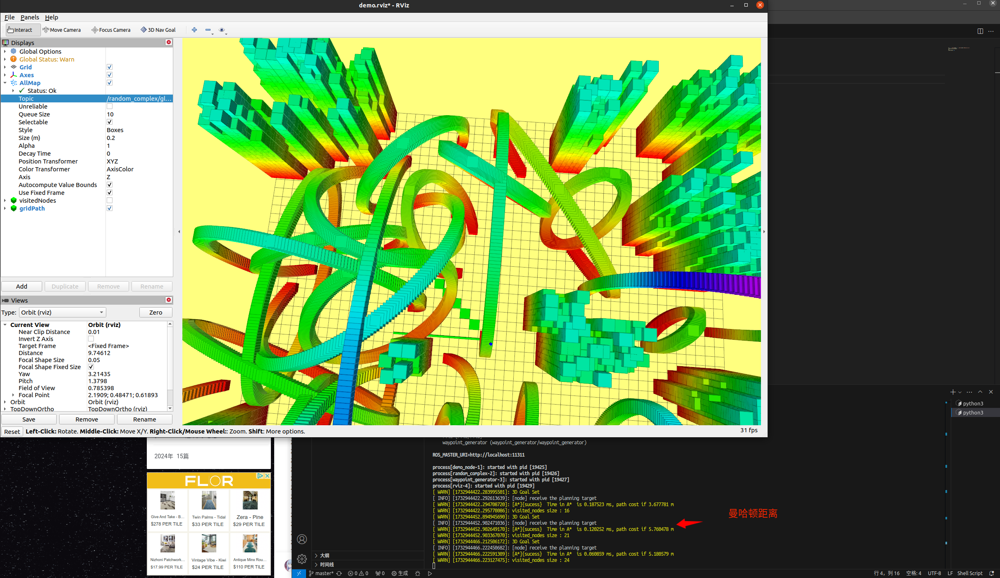
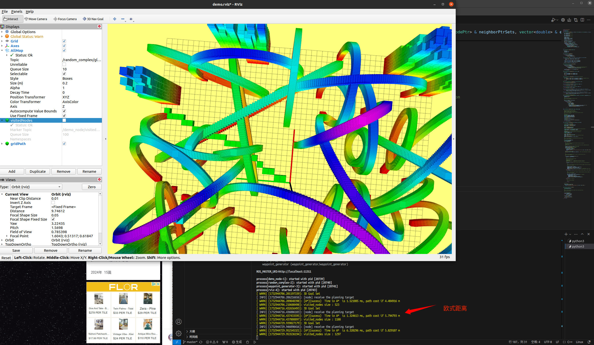
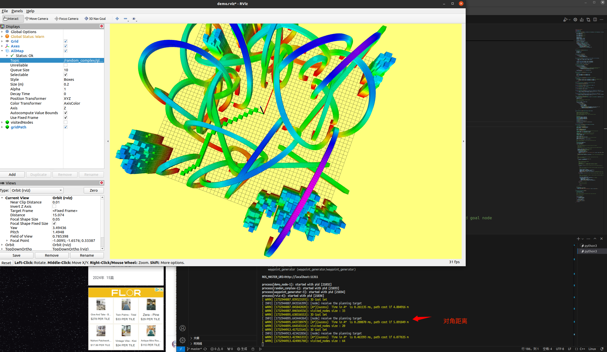
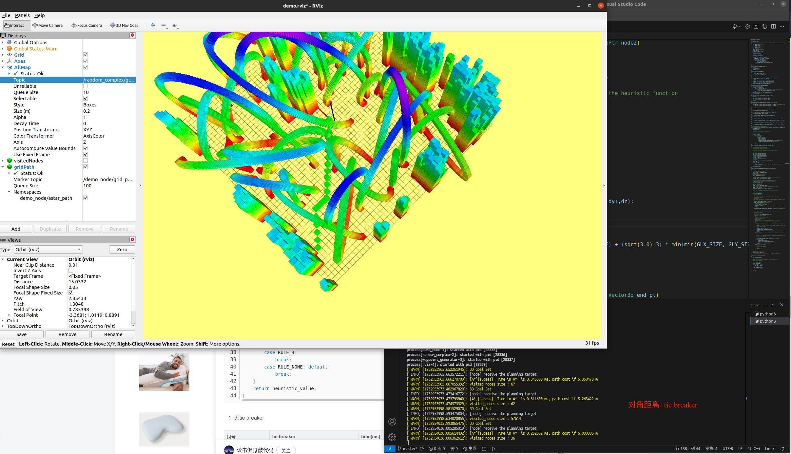

## 1119 课下作业 CPP下ROS A*算法

### 如何编译功能包

切换到工作空间下面的src文件夹 执行"bash cleanNbuild.sh"脚本

该脚本会清除之前编译的文件并重新编译

### 简要的算法流程

主要的函数为void AstarPathFinder::AstarGraphSearch(Vector3d start_pt, Vector3d end_pt)

输入参数是 起始点 和 目标点 A*算法流程为

1. 初始化地图 输入起始节点和目标节点
2. 使用multimap容器对搜索节点自动排序
3. 依次取出f值最小的节点 判断是否为目标节点
4. 若是目标节点 停止搜索 进行路径回溯 返回路径
5. 若不是路径节点 拓展当前节点 计算他们的f值 并放入容器中 返回第三步

其中有一些需要注意的点：

1. 在拓展临近节点的时候要注意拓展的点是否超出地图边界
2. 拓展节点若被拓展过，需要重新计算g值，此时不能对拓展节点直接操作，应该先记录之前的g值
3. 使用multimap容器来做open list方便快捷 需要注意multimap 以及 vector容器的一些函数使用规则 比如 push_back 和 emplace_back的区别

### 不同启发函数对算法的影响

以下为启发式函数部分的代码：

```
double AstarPathFinder::getHeu(GridNodePtr node1, GridNodePtr node2)
{
    /* 
    choose possible heuristic function you want
    Manhattan, Euclidean, Diagonal, or 0 (Dijkstra)
    Remember tie_breaker learned in lecture, add it here ?
    *
    STEP 1: finish the AstarPathFinder::getHeu , which is the heuristic function
    please write your code below
    *
    */
    //获取两点的坐标k
    Eigen::Vector3i node1_idx = node1->index;
    Eigen::Vector3i node2_idx = node2->index;
    double dx = abs(node2_idx[0]-node1_idx[0]);
    double dy = abs(node2_idx[1]-node1_idx[1]);
    double dz = abs(node2_idx[2]-node1_idx[2]);
    //计算曼哈顿距离
    double md = dx + dy + dz;
    //计算欧式距离
    double ed = pow((dx*dx+dy*dy+dz*dz),0.5);
    //计算对角距离
    double dd = dx + dy + dz + (sqrt(3.0)-3) * min(min(dx,dy),dz);

    double h = dd;
    #define _use_Tie_breaker 0//tie breaker
    #if _use_Tie_breaker
        {
            double p = 1.0/(GLX_SIZE + GLY_SIZE + GLZ_SIZE) + (sqrt(3.0)-3) * min(min(GLX_SIZE, GLY_SIZE), GLZ_SIZE);
            double h = h*(1.0+p);
        }
    #endif
    return (node1->gScore+h);
}
```

注意：算法运行时间随着电脑配置不同以及地图信息和起终点不同会有较大差异

使用曼哈顿距离构造的启发式函数 时间在0.1ms级别



使用欧式距离构造的启发式函数 时间在10ms级别 其在运行时访问的节点远多于曼哈顿距离的启发函数



使用对角距离构造的启发式函数 时间在1ms级别 算法访问节点数与曼哈顿距离的启发函数差距不大



### Tie Breaker的影响

以下为tie-breaker部分的代码：

```
 #define _use_Tie_breaker 1//tie breaker
    #if _use_Tie_breaker
        {
            double p = 1.0/(GLX_SIZE + GLY_SIZE + GLZ_SIZE) + (sqrt(3.0)-3) * min(min(GLX_SIZE, GLY_SIZE), GLZ_SIZE);
            double h = h*(1.0+p);
        }
    #endif
    return (node1->gScore+h);
```

运行结果如下，可以看到加入tie-breaker后运行时间差距不大，甚至tie-breaker会更加耗时一些


