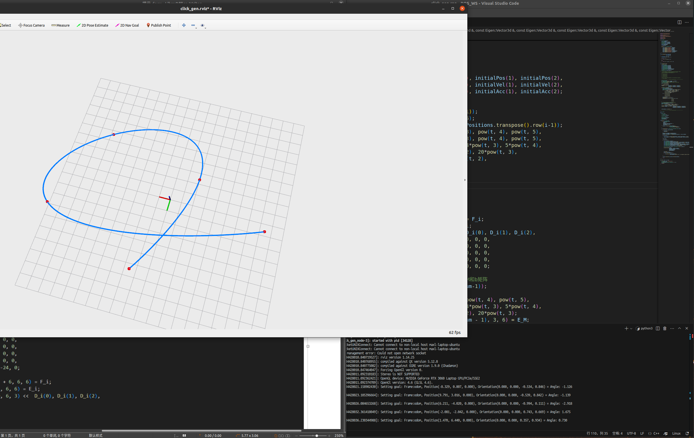

## 1203 CPP BIVP轨迹优化

根据提示，实现BIVP轨迹优化

主要代码如下：

```
void minimumJerkTrajGen(
    // Inputs:
    const int pieceNum,
    const Eigen::Vector3d &initialPos,
    const Eigen::Vector3d &initialVel,
    const Eigen::Vector3d &initialAcc,
    const Eigen::Vector3d &terminalPos,
    const Eigen::Vector3d &terminalVel,
    const Eigen::Vector3d &terminalAcc,
    const Eigen::Matrix3Xd &intermediatePositions,
    const Eigen::VectorXd &timeAllocationVector,
    // Outputs:
    Eigen::MatrixX3d &coefficientMatrix)
{
    // coefficientMatrix is a matrix with 6*piece num rows and 3 columes
    // As for a polynomial c0+c1*t+c2*t^2+c3*t^3+c4*t^4+c5*t^5,
    // each 6*3 sub-block of coefficientMatrix is
    // --              --
    // | c0_x c0_y c0_z |
    // | c1_x c1_y c1_z |
    // | c2_x c2_y c2_z |
    // | c3_x c3_y c3_z |
    // | c4_x c4_y c4_z |
    // | c5_x c5_y c5_z |
    // --              --
    // Please computed coefficientMatrix of the minimum-jerk trajectory
    // in this function

    // ------------------------ Put your solution below ------------------------

    Eigen::MatrixXd M,b;
    M = Eigen::MatrixXd::Zero(6 * pieceNum , 6 * pieceNum );
    b = Eigen::MatrixXd::Zero(6 * pieceNum , 3);
    //计算初始点的位置、速度、加速度约束等式，将相应值赋给M和b矩阵
    Eigen::MatrixXd F_0(3,6);
    F_0 <<  1, 0, 0, 0, 0, 0,
            0, 1, 0, 0, 0, 0,
            0, 0, 2, 0, 0, 0;
    M.block(0, 0, 3, 6) = F_0;
    b.block(0, 0, 3, 3) <<  initialPos(0), initialPos(1), initialPos(2), 
                            initialVel(0), initialVel(1), initialVel(2), 
                            initialAcc(0), initialAcc(1), initialAcc(2);
    //根据最优值原理求E,F,D表达式
    for (int i=1; i < pieceNum ; i++){
        double t(timeAllocationVector(i-1));
        Eigen::MatrixXd F_i(6,6), E_i(6,6);
        Eigen::Vector3d D_i(intermediatePositions.transpose().row(i-1));
        E_i <<  1, t, pow(t, 2), pow(t, 3), pow(t, 4), pow(t, 5),
                1, t, pow(t, 2), pow(t, 3), pow(t, 4), pow(t, 5),
                0, 1, 2*t, 3*pow(t, 2), 4*pow(t, 3), 5*pow(t, 4),
                0, 0, 2, 6*t, 12*pow(t, 2), 20*pow(t, 3),
                0, 0, 0, 6, 24*t, 60*pow(t, 2),
                0, 0, 0, 0, 24, 120*t;
        F_i <<  0, 0, 0, 0, 0, 0,
                -1, 0, 0, 0, 0, 0,
                0, -1, 0, 0, 0, 0,
                0, 0, -2, 0, 0, 0,
                0, 0, 0, -6, 0, 0,
                0, 0, 0, 0, -24, 0;
        int j = 6 * (i-1);
        M.block(3+6*(i-1), j + 6, 6, 6) = F_i;
        M.block(3+6*(i-1), j, 6, 6) = E_i;
        b.block(3+6*(i-1), 0, 6, 3) <<  D_i(0), D_i(1), D_i(2),
                                        0, 0, 0,
                                        0, 0, 0,
                                        0, 0, 0,
                                        0, 0, 0,
                                        0, 0, 0;
    }
    //计算终点的位置、速度havior，将相应值赋给M和b矩阵
    double t(timeAllocationVector(pieceNum-1));
    Eigen::MatrixXd E_M(3,6);
    E_M <<  1, t, pow(t, 2), pow(t, 3), pow(t, 4), pow(t, 5),
                0, 1, 2*t, 3*pow(t, 2), 4*pow(t, 3), 5*pow(t, 4),
                0, 0, 2, 6*t, 12*pow(t, 2), 20*pow(t, 3);
    M.block(6 * pieceNum -3, 6 * (pieceNum - 1), 3, 6) = E_M;
    b.block(6 * pieceNum -3, 0, 3, 3) <<    terminalPos(0), terminalPos(1), terminalPos(2), 
                                            terminalVel(0), terminalVel(1), terminalVel(2), 
                                            terminalAcc(0), terminalAcc(1), terminalAcc(2);
                                    
 
    coefficientMatrix = M.inverse() * b;

    // ------------------------ Put your solution above ------------------------
}
```

在工作空间下编译

```
catkin_make
```

运行：

```
source devel/setup.bash
rospack profile
(new terminal)
source devel/setup.bash
roslaunch lec5_hw click_gen.launch
```

运行结果：

